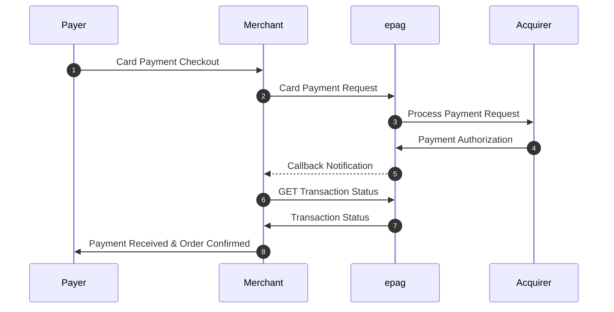

# Credit Cards

## Overview

This API enables credit card payments by providing a structured request payload that includes contract details, payment information, card details, authentication parameters, and billing address.

## Features

- `Standard Credit Card Payments`: Process payments using credit cards securely.
- `2DS Payment`: Supports two-factor authentication for added security.
- `Delay Capture/Pre-Authorization`: Allows capturing the payment at a later time after authorization.
- `External 3DS Payment`: Supports external 3D Secure authentication for fraud prevention.
- `Save Card/Tokenization`: Enables saving the card details for future transactions using tokenization.

## 2DS Payment Flow



## Request Payload

```json
{
    "contract_id": "MY_CONTRACT_ID",
    "reference_id": "MY_REFERENCE_ID",
    "notification_url": "https://my.notification.url/callback/",
    "ip_address": "0.0.0.0",
    "payment": {
        "method": "CREDITCARD",
        "amount": 123.45,
        "asset": "BRL",
        "soft_descriptor": "SOFT_DESCRIPTOR",
        "delay_capture": true,
        "save_card": false,
        "currency": "BRL",
        "country": "BR",
        "card": {
            "number": "5240082975622454",
            "holder": "Alice Sonnentag",
            "cvv": "123",
            "year": 2026,
            "month": 12,
            "installments": 1
        }
    },
    "person": {
        "full_name": "Alice Sonnentag",
        "email": "alice@sonnentag.com",
        "tax_id": "39784045087",
        "birth_date": "1978-08-21"
    },
    "disable_address": false,
    "address": {
        "main": "Rua Araguari",
        "number": "817",
        "additional": "Apto 54",
        "locality": "Vila Sônia",
        "city": "São Paulo",
        "state": "SP",
        "country": "BR",
        "zip_code": "04514-041"
    },
    "extra_data": {
        "my-conciliation-number": "xxxxxx"
    }
}
```

## Field Descriptions

### Main Fields

- `contract_id` (*string*): Identifier of the contract associated with the payment.
- `reference_id` (*string*): Unique reference identifier for transaction tracking.
- `notification_url` (*string*): URL for sending notifications about payment status.
- `ip_address` (*string*): IP address of the customer making the payment.

### `payment` Object

- `method` (*string*): Payment method used. Example: "CREDITCARD".
- `amount` (*number*): Transaction amount.
- `asset` (*string*): Transaction currency (example: "BRL").
- `soft_descriptor` (*string*): Name appearing on the credit card statement.
- `delay_capture` (*boolean*): Indicates if payment capture will be delayed.
- `save_card` (*boolean*): Indicates if the card will be saved for future transactions.
- `currency` (*string*): Currency used.
- `country` (*string*): Transaction country.

#### `card` Object

- `number` (*string*): Credit card number.
- `holder` (*string*): Cardholder's name.
- `cvv` (*string*): Card security code.
- `year` (*number*): Card expiration year.
- `month` (*number*): Card expiration month.
- `installments` (*number*): Number of installments.

### `person` Object

- `full_name` (*string*): Payer's full name.
- `email` (*string*): Payer's email.
- `tax_id` (*string*): Payer's tax ID (CPF or CNPJ).
- `birth_date` (*string*): Date of birth in "YYYY-MM-DD" format.

### `address` Object

- `main` (*string*): Street name.
- `number` (*string*): House/building number.
- `additional` (*string*): Address complement.
- `locality` (*string*): Neighborhood.
- `city` (*string*): City.
- `state` (*string*): State.
- `country` (*string*): Country.
- `zip_code` (*string*): ZIP code.

### `extra_data` Object

- `my-conciliation-number` (*string*): Transaction reconciliation number.

## Considerations

- Ensure to use real and secure data in the implementation.
- The notification URL must be prepared to receive POST calls with transaction status updates.
- Additional features such as 3DS authentication and tokenization are covered in separate documentation.

## Example Response

```json
{
    "transaction_id": "TRANSACTION_12345",
    "status": "AUTHORIZED",
    "authorization_code": "AUTH_67890",
    "payment_url": "https://payment.gateway/redirect"
}
```

This documentation provides an overview of how to integrate credit card payments using this API.

