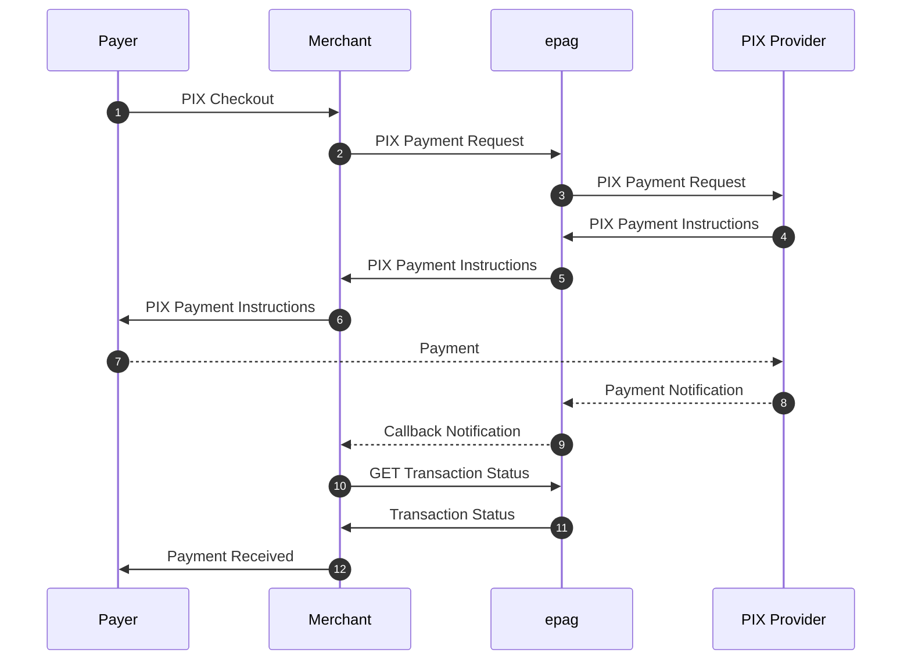

import Tabs from '@theme/Tabs';
import TabItem from '@theme/TabItem';

# PIX

```jsx
  https://api-sandbox.epag.io/pix/simple
```

## Considerations

This process is designed with a smart approach to handle the compulsory Tax ID verification for all international transactions in Brazil, while maintaining optimal conversion rates. The process facilitates:

- Immediate display of a QR code to the payer without the need for preliminary data collection, resulting in a higher conversion rate.
  - In order to use this process just send the required fields as marked below.
- Utilization of a CPF (Cadastro de Pessoas Físicas) linked to the transaction, which merchants have previously gathered, or the option to collect it on the checkout page—this method generally yields a lower conversion rate, but can be advantageous in certain scenarios based on the merchant's specific needs.
  - In order to this process send the payer's CPF or CNPJ on the tax_id field. In the case of an invalid tax id the transaction may be declined.

## PIX Flow



## Request description

This HTTP POST request is used to create a PIX payment using the provided payload in the raw request body. The request payload includes the following fields:
- `contract_id` (required/string): Merchant's contract id.
- `reference_id` (required/string/max 45 chars): External code created by the merchant to reference this payment (e.g. order number).
- `notification_url` (required/string): URL to post callbacks to this payment.
- `ip_address` (optional/string): Remote IP Address(IPv4/IPv6).
- `payment` (required/object): The payment data:
  - `amount` (required/float): Total amount of the payment. Value must have a maximum of two decimal places.
  - `asset` (optional/string): Reference code for asset for the sale's amount. Default: `BRL`.
  - `soft_descriptor` (optional/string): Soft descriptor to use at transaction.
  - `currency` (required/string): Currency code in ISO-4217.
  - `country` (required/string): Country code in ISO 3166-2.
- `person` (optional/object): The person data:
  - `full_name` (optional/string): Person’s full name.
  - `email` (optional/string): Person’s email provided to the merchant.
  - `tax_id` (optional/string): Unique identifier for this person in country tax system (e.g. in Brazil: CPF).
  - `birth_date` (optional/date/YYYY-MM-DD): Person’s date of birth.


### Response JSON Schema

```jsx title="json"
{
    "type": "object",
    "properties": {
        "transaction_status": {"type": "string"},
        "payment_token": {"type": "string"},
        "reference_id": {"type": "string"},
        "pix_qr_code": {"type": "string"},
        "pix_code": {"type": "string"},
        "pix_amount": {"type": "string"},
        "refresh_token": {"type": "string"},
        "totals": {
            "type": "object",
            "properties": {
                "amount": {"type": "number"},
                "original_amount": {"type": "number"},
                "original_asset": {"type": "string"},
                "customer_fees": {"type": "number"},
                "customer_amount": {"type": "number"},
                "asset": {"type": "string"}
            }
        },
        "customer_fees": {
            "type": "object",
            "additionalProperties": {"type": "number"}
        }
    }
}
```

| AUTHORIZATION | API Key         | 
| ------------- | --------------- |
| Key           | X-Auth-Token    |
| Value         | MY_ACCESS_TOKEN |

### Body Raw(json)

```jsx title="json"
{
    "contract_id": "MY_CONTRACT_ID",
    "reference_id": "MY_REFERENCE_ID",
    "notification_url": "https://my.notification.url/callback/",
    "ip_address": "0.0.0.0",
    "payment": {
        "amount": 123.45,
        "asset": "BRL",
        "soft_descriptor": "SOFT_DESCRIPTOR",
        "currency": "BRL",
        "country": "BR"
    },
    "person": {
        "full_name": "Alice Sonnentag",
        "email": "alice@sonnentag.com",
        "tax_id": "39784045087",
        "birth_date": "1978-08-21"
    },
    "extra_data": {
        "my-conciliation-number": "xxxxxx"
    }
}
```

### Example Request

<Tabs>

  <TabItem value="success" label="200 - Success">
      #### Example Request
        ```jsx title="200 - Success"
            curl --location 'https://api-sandbox.epag.io/pix/simple' \
            --header 'X-Auth-Token: MY_ACCESS_TOKEN' \
            --data-raw '{
                "contract_id": "MY_CONTRACT_ID",
                "reference_id": "MY_REFERENCE_ID",
                "notification_url": "https://my.notification.url/callback/",
                "ip_address": "0.0.0.0",
                "payment": {
                    "amount": 123.45,
                    "asset": "BRL",
                    "soft_descriptor": "SOFT_DESCRIPTOR",
                    "currency": "BRL",
                    "country": "BR"
                },
                "person": {
                    "full_name": "Alice Sonnentag",
                    "email": "alice@sonnentag.com",
                    "tax_id": "39784045087",
                    "birth_date": "1978-08-21"
                },
                "extra_data": {
                    "my-conciliation-number": "xxxxxx"
                }
            }'
        ```

      #### Example Response
        ```jsx title="Header"
          Content-Type: application/json
        ```  
        ```jsx title="Body"
            {
              "transaction_status": "PROCESSING",
              "payment_token": "0196e128-c6c7-4249-9f20-21a4c2eb1506",
              "reference_id": "MY_REFERENCE_ID",
              "pix_qr_code": "BASE64_ZIPPED_PNG",
              "pix_code": "00020101021226600016BR.COM.PAGSEGURO013612BB85E0-6156-45D0-BD28-5E04456185FF5204899953039865406123.455802BR5925ELPL Tecnologia em Pagame6009Sao Paulo63047B99",
              "pix_amount": "123.45",
              "refresh_token": "MY_ACCESS_TOKEN",
              "totals": {
                "amount": 123.45,
                "original_amount": 123.45,
                "original_asset": "BRL",
                "customer_fees": 0,
                "customer_amount": 123.45,
                "asset": "BRL"
              },
              "customer_fees": {}
            }
        ```
    </TabItem>

    <TabItem value="bad-request" label="400 - Bad Request">
      #### Example Request
        ```jsx title="400 - Bad Request"
            curl --location 'https://api-sandbox.epag.io/pix/simple' \
            --header 'X-Auth-Token: MY_ACCESS_TOKEN' \
            --data-raw '{
                "contract_id": "MY_CONTRACT_ID",
                "reference_id": "MY_REFERENCE_ID",
                "notification_url": "https://my.notification.url/callback/",
                "ip_address": "0.0.0.0",
                "payment": {
                    "amount": 123.45,
                    "asset": "BRL",
                    "soft_descriptor": "SOFT_DESCRIPTOR",
                    "currency": "BRL",
                    "country": "BR"
                },
                "person": {
                    "full_name": "Alice Sonnentag",
                    "email": "alice@sonnentag.com",
                    "tax_id": "397840450870",
                    "birth_date": "1978-08-21"
                },
                "extra_data": {
                    "my-conciliation-number": "xxxxxx"
                }
            }'
        ```

      #### Example Response
        ```jsx title="Header"
          Content-Type: application/json
        ```  
        ```jsx title="Body"
            {
              "timestamp": "2024-01-16T20:54:57.880+0000",
              "status": 400,
              "error": "Bad Request",
              "message": "person.tax_id: invalid tax ID number",
              "path": "/pix/simple",
              "errors": [
                {
                  "code": "00.01.0044",
                  "description": "person.tax_id: invalid tax ID number"
                }
              ],
              "refresh_token": "MY_ACCESS_TOKEN"
            }
        ```
    </TabItem>

    <TabItem value="unauthorized" label="401 - Unauthorized">
      #### Example Request
        ```jsx title="401 - Unauthorized"
            curl --location 'https://api-sandbox.epag.io/pix/simple' \
            --header 'X-Auth-Token: INVALID_ACCESS_TOKEN' \
            --data-raw '{
                "contract_id": "MY_CONTRACT_ID",
                "reference_id": "MY_REFERENCE_ID",
                "notification_url": "https://my.notification.url/callback/",
                "ip_address": "0.0.0.0",
                "payment": {
                    "amount": 123.45,
                    "asset": "BRL",
                    "soft_descriptor": "SOFT_DESCRIPTOR",
                    "currency": "BRL",
                    "country": "BR"
                },
                "person": {
                    "full_name": "Alice Sonnentag",
                    "email": "alice@sonnentag.com",
                    "tax_id": "39784045087",
                    "birth_date": "1978-08-21"
                },
                "extra_data": {
                    "my-conciliation-number": "xxxxxx"
                }
            }'
        ```

      #### Example Response
        ```jsx title="Header"
          Content-Type: application/json
        ```  
        ```jsx title="Body"
            {
              "timestamp": "2024-01-16T15:35:10.131+0000",
              "status": 401,
              "error": "Unauthorized",
              "message": "Access Denied",
              "path": "/pix/simple"
            }
        ```
    </TabItem>

    <TabItem value="unprocessable-entity" label="422 - Unprocessable Entity">
      #### Example Request
        ```jsx title="422 - Unprocessable Entity"
            curl --location 'https://api-sandbox.epag.io/pix/simple' \
            --header 'X-Auth-Token: MY_ACCESS_TOKEN' \
            --data-raw '{
                "contract_id": "INVALID_CONTRACT_ID",
                "reference_id": "MY_REFERENCE_ID",
                "notification_url": "https://my.notification.url/callback/",
                "ip_address": "0.0.0.0",
                "payment": {
                    "amount": 123.45,
                    "asset": "BRL",
                    "soft_descriptor": "SOFT_DESCRIPTOR",
                    "currency": "BRL",
                    "country": "BR"
                },
                "person": {
                    "full_name": "Alice Sonnentag",
                    "email": "alice@sonnentag.com",
                    "tax_id": "39784045087",
                    "birth_date": "1978-08-21"
                },
                "extra_data": {
                    "my-conciliation-number": "xxxxxx"
                }
            }'
        ```

      #### Example Response
        ```jsx title="Header"
          Content-Type: application/json
        ```  
        ```jsx title="Body"
            {
              "timestamp": "2024-01-16T20:50:25.715+0000",
              "status": 422,
              "error": "Unprocessable Entity",
              "message": "Invalid contract / project",
              "path": "/pix/simple",
              "errors": [
                {
                  "code": "00.01.0021",
                  "description": "Invalid contract / project"
                }
              ],
              "refresh_token": "MY_ACCESS_TOKEN"
            }
        ```
    </TabItem>

    <TabItem value="bad-gateway" label="502 - Bad Gateway">
      #### Example Request
        ```jsx title="502 - Bad Gateway"
            curl --location 'https://api-sandbox.epag.io/pix/simple' \
            --header 'X-Auth-Token: MY_ACCESS_TOKEN' \
            --data-raw '{
                "contract_id": "MY_CONTRACT_ID",
                "reference_id": "MY_REFERENCE_ID",
                "notification_url": "https://my.notification.url/callback/",
                "ip_address": "0.0.0.0",
                "payment": {
                    "amount": 123.45,
                    "asset": "BRL",
                    "soft_descriptor": "SOFT_DESCRIPTOR",
                    "currency": "BRL",
                    "country": "BR"
                },
                "person": {
                    "full_name": "Alice Sonnentag",
                    "email": "alice@sonnentag.com",
                    "tax_id": "39784045087",
                    "birth_date": "1978-08-21"
                },
                "extra_data": {
                    "my-conciliation-number": "xxxxxx"
                }
            }'
        ```

      #### Example Response
        ```jsx title="Header"
          Content-Type: application/json
        ```  
        ```jsx title="Body"
            {
              "timestamp": "2024-01-16T20:12:28.156+0000",
              "status": 502,
              "error": "Bad Gateway",
              "message": "There was an issue when contacting an external API, please contact support",
              "path": "/pix/simple",
              "errors": [
                {
                  "code": "00.03.0001",
                  "description": "There was an issue when contacting an external API, please contact support"
                }
              ],
              "refresh_token": "MY_ACCESS_TOKEN"
            }
        ```
    </TabItem>

</Tabs>

