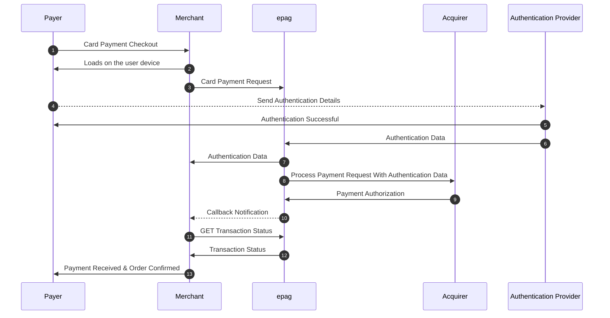
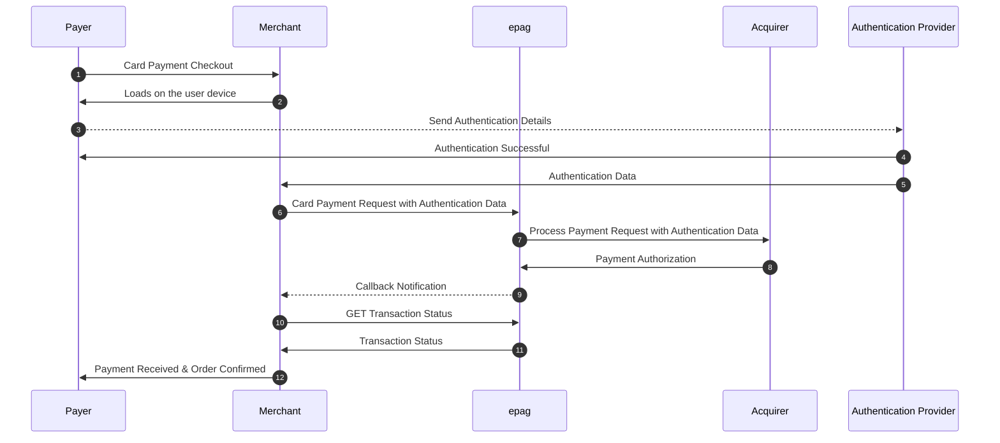

# Debit Cards

## Overview

This document details how to process **debit card payments**. Debit card transactions typically require **immediate fund availability** and may require **additional authentication** from the issuing bank.

## How Debit Card Payments Work

1. The customer enters debit card details.
2. The payment gateway may require additional authentication (e.g., **3DSecure** or OTP verification).
3. The bank verifies fund availability and approves the transaction.
4. The payment is instantly debited from the customer’s account.

## Debit Card Payment Checkout Internal Authentication (epag)


## Debit Card Payment Checkout External Authentication



## Debit Card Payment Fields

To process a debit card transaction, set `method` to `DEBITCARD`:

```json
"payment": {
    "method": "DEBITCARD",
    "amount": 100.00,
    "currency": "USD",
    "card": {
        "number": "5222222222222222",
        "holder": "John Doe",
        "cvv": "456",
        "year": 2026,
        "month": 11
    }
}
```

## Additional Authentication

Some debit card transactions require **3D Secure authentication**, similar to credit cards. In such cases, include the `authentication` object:

```json
"authentication": {
    "cavv": "BwABBylVaQAAAAFwllVpAAAAAAA=",
    "xid": "BwABBylVaQAAAAFwllVpAAAAAAA=",
    "eci": "05",
    "version": "2.1.0",
    "dstrans_id": "DIR_SERVER_TID"
}
```

## Example Response

```json
{
    "transaction_id": "TRANSACTION_98765",
    "status": "AUTHORIZED",
    "authorization_code": "AUTH_54321"
}
```

## Considerations

- Debit card payments **require sufficient funds** at the time of purchase.
- Some issuers **require additional authentication** for security purposes.
- **Refund processing** may vary depending on the bank’s policies.

By supporting debit card payments, merchants can provide **real-time transactions** with added security measures.