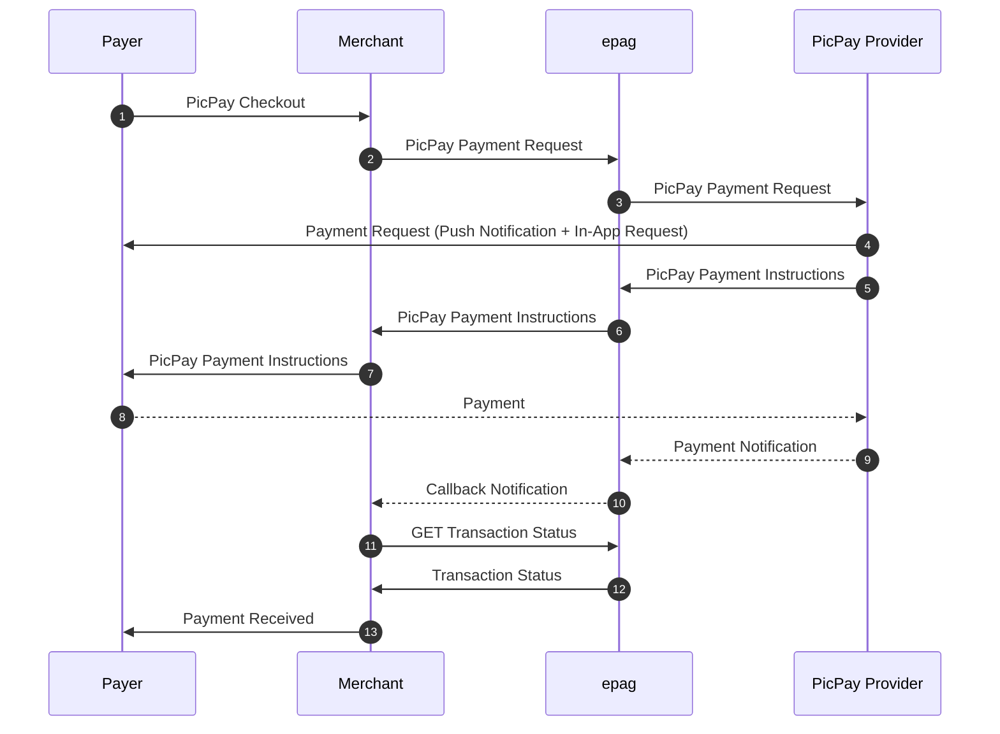

import Tabs from '@theme/Tabs';
import TabItem from '@theme/TabItem';

# PicPay

```jsx
  https://api-sandbox.epag.io/picpay/simple
```

## Overview

Integrating PicPay allows your business to accept payments from a wide user base in Brazil through a fast and convenient digital wallet.
Our API facilitates the communication between your system, PicPay, and the customer's PicPay app.

Here's a simplified breakdown of the payment process from a technical integration standpoint:
1. **Merchant Initiates Payment Request:** Your system sends a payment request to the `Your PSP Name` API. This request includes essential transaction details like the amount and a unique order identifier.
2. **QR Code Generation and Push Notification Trigger:** Upon receiving your request, the `Your PSP Name` system processes the information and interacts with the PicPay platform. This process triggers two simultaneous actions:
    - A unique **QR code** for the transaction is generated and returned to your system via the API.
    - A **push notification** is sent directly to the customer's mobile device, alerting them of the pending payment request within their PicPay app.
3. **Payer Interaction via App:** The customer can proceed with the payment in one of two ways on their mobile device:
    - They can **open the push notification**, which directly launches the relevant payment screen within their PicPay app.
    - Alternatively, they can open their PicPay app and use the **in-app camera to scan the QR code** displayed by your system (e.g., on a computer screen or a physical display).
4. **Payer Authorizes Payment:** Within the PicPay app, the customer reviews the transaction details (amount, merchant) and explicitly **authorizes the payment**, typically by entering their PicPay PIN or using biometric authentication.
5. **Payment Confirmation:** Once the customer successfully authorizes the payment in the PicPay app, the PicPay platform confirms the transaction. The `Your PSP Name` system receives this confirmation in real-time and promptly **notifies your system** (e.g., via a webhook) about the successful payment, allowing you to finalize the order or service.

This streamlined process ensures a quick and user-friendly payment experience for your customers while providing your business with efficient and confirmed transactions. Refer to the subsequent sections of this documentation for detailed API specifications and integration guidelines.


## PicPay Flow



## Request Description

This HTTP POST request is used to create a PicPay payment using the provided payload in the raw request body. The request payload includes the following fields:
- `contract_id` (required/string): Merchant's contract id.
- `reference_id` (required/string/max 45 chars): External code created by the merchant to reference this payment (e.g. order number).
- `notification_url` (required/string): URL to post callbacks to this payment.
- `ip_address` (optional/string): Remote IP Address(IPv4/IPv6).
- `payment` (required/object): The payment data:
  - `amount` (required/float): Total amount of the payment. Value must have a maximum of two decimal places.
  - `asset` (optional/string): Reference code for asset for the sale's amount. Default: `BRL`.
  - `delay_capture` (optional/boolean): `true` to pre-authorize payment for later capture. Default: false. Pre-auth capture/cancelation has a TTL of 5 days.
  - `currency` (required/string): Currency code in ISO-4217. Valid option: `BRL`.
  - `country` (required/string): Country code in ISO 3166-2. Valid option: `BR`.
  - `picpay` (optional/object): The PicPay data:
    - `expiration_date` (optional/date/YYYY-MM-DD): Expiration date (if not informed system will assume 2 days of current date).
- `person` (optional/object): The person data:
  - `full_name` (optional/string): Person’s full name.
  - `email` (optional/string): Person’s email provided to the merchant.
  - `tax_id` (required/string): Unique identifier for this person in country tax system (e.g. in Brazil: CPF).
  - `birth_date` (optional/date/YYYY-MM-DD): Person’s date of birth.


| AUTHORIZATION | API Key         | 
| ------------- | --------------- |
| Key           | X-Auth-Token    |
| Value         | MY_ACCESS_TOKEN |

### Body Raw(json)

```jsx title="json"
{
    "contract_id": "MY_CONTRACT_ID",
    "reference_id": "MY_REFERENCE_ID",
    "notification_url": "https://my.notification.url/callback/",
    "ip_address": "0.0.0.0",
    "payment": {
        "amount": 123.45,
        "asset": "BRL",
        "delay_capture": false,
        "currency": "BRL",
        "country": "BR",
        "picpay": {
            "expiration_date": "2024-12-31"
        }
    },
    "person": {
        "full_name": "Alice Sonnentag",
        "email": "alice@sonnentag.com",
        "tax_id": "39784045087"
    },
    "extra_data": {
        "my-conciliation-number": "xxxxxx"
    }
}
```

### Example Request

<Tabs>

  <TabItem value="success" label="200 - Success">
      #### Example Request
        ```jsx title="200 - Success"
            curl --location 'https://api-sandbox.epag.io/picpay/simple' \
            --header 'X-Auth-Token: MY_ACCESS_TOKEN' \
            --data-raw '{
                "contract_id": "MY_CONTRACT_ID",
                "reference_id": "MY_REFERENCE_ID",
                "notification_url": "https://my.notification.url/callback/",
                "ip_address": "0.0.0.0",
                "payment": {
                    "amount": 123.45,
                    "asset": "BRL",
                    "delay_capture": false,
                    "currency": "BRL",
                    "country": "BR",
                    "picpay": {
                        "expiration_date": "2024-12-31"
                    }
                },
                "person": {
                    "full_name": "Alice Sonnentag",
                    "email": "alice@sonnentag.com",
                    "tax_id": "39784045087"
                },
                "extra_data": {
                    "my-conciliation-number": "xxxxxx"
                }
            }'
        ```

      #### Example Response
        ```jsx title="Header"
          Content-Type: application/json
        ```  
        ```jsx title="Body"
            {
              "transaction_status": "PROCESSING",
              "payment_token": "0196e128-c6c7-4249-9f20-21a4c2eb1506",
              "reference_id": "MY_REFERENCE_ID",
              "qr_code": "BASE64_ZIPPED_PNG",
              "amount": "123.45",
              "expiration_date": "2024-11-28",
              "refresh_token": "MY_ACCESS_TOKEN",
              "totals": {
                "amount": 123.45,
                "original_amount": 123.45,
                "original_asset": "BRL",
                "customer_fees": 0,
                "customer_amount": 123.45,
                "asset": "BRL"
              },
              "customer_fees": {}
            }
        ```
    </TabItem>

    <TabItem value="bad-request" label="400 - Bad Request">
      #### Example Request
        ```jsx title="400 - Bad Request"
            curl --location 'https://api-sandbox.epag.io/picpay/simple' \
            --header 'X-Auth-Token: MY_ACCESS_TOKEN' \
            --data-raw '{
                "contract_id": "MY_CONTRACT_ID",
                "reference_id": "MY_REFERENCE_ID",
                "notification_url": "https://my.notification.url/callback/",
                "ip_address": "0.0.0.0",
                "payment": {
                    "amount": 123.45,
                    "asset": "BRL",
                    "delay_capture": false,
                    "currency": "BRL",
                    "country": "BR",
                    "picpay": {
                        "expiration_date": "2024-12-31"
                    }
                },
                "person": {
                    "full_name": "Alice Sonnentag",
                    "email": "alice@sonnentag.com",
                    "tax_id": "397840450870"
                },
                "extra_data": {
                    "my-conciliation-number": "xxxxxx"
                }
            }'
        ```

      #### Example Response
        ```jsx title="Header"
          Content-Type: application/json
        ```  
        ```jsx title="Body"
            {
              "timestamp": "2024-01-16T20:54:57.880+0000",
              "status": 400,
              "error": "Bad Request",
              "message": "person.tax_id: invalid tax ID number",
              "path": "/picpay/simple",
              "errors": [
                {
                  "code": "00.01.0044",
                  "description": "person.tax_id: invalid tax ID number"
                }
              ],
              "refresh_token": "MY_ACCESS_TOKEN"
            }
        ```
    </TabItem>

    <TabItem value="unauthorized" label="401 - Unauthorized">
      #### Example Request
        ```jsx title="401 - Unauthorized"
            curl --location 'https://api-sandbox.epag.io/picpay/simple' \
            --header 'X-Auth-Token: INVALID_ACCESS_TOKEN' \
            --data-raw '{
                "contract_id": "MY_CONTRACT_ID",
                "reference_id": "MY_REFERENCE_ID",
                "notification_url": "https://my.notification.url/callback/",
                "ip_address": "0.0.0.0",
                "payment": {
                    "amount": 123.45,
                    "asset": "BRL",
                    "delay_capture": false,
                    "currency": "BRL",
                    "country": "BR",
                    "picpay": {
                        "expiration_date": "2024-12-31"
                    }
                },
                "person": {
                    "full_name": "Alice Sonnentag",
                    "email": "alice@sonnentag.com",
                    "tax_id": "39784045087"
                },
                "extra_data": {
                    "my-conciliation-number": "xxxxxx"
                }
            }'
        ```

      #### Example Response
        ```jsx title="Header"
          Content-Type: application/json
        ```  
        ```jsx title="Body"
            {
              "timestamp": "2024-01-16T15:35:10.131+0000",
              "status": 401,
              "error": "Unauthorized",
              "message": "Access Denied",
              "path": "/picpay/simple"
            }
        ```
    </TabItem>

    <TabItem value="unprocessable-entity" label="422 - Unprocessable Entity">
      #### Example Request
        ```jsx title="422 - Unprocessable Entity"
            curl --location 'https://api-sandbox.epag.io/picpay/simple' \
            --header 'X-Auth-Token: MY_ACCESS_TOKEN' \
            --data-raw '{
                "contract_id": "INVALID_CONTRACT_ID",
                "reference_id": "MY_REFERENCE_ID",
                "notification_url": "https://my.notification.url/callback/",
                "ip_address": "0.0.0.0",
                "payment": {
                    "amount": 123.45,
                    "asset": "BRL",
                    "delay_capture": false,
                    "currency": "BRL",
                    "country": "BR",
                    "picpay": {
                        "expiration_date": "2024-12-31"
                    }
                },
                "person": {
                    "full_name": "Alice Sonnentag",
                    "email": "alice@sonnentag.com",
                    "tax_id": "39784045087"
                },
                "extra_data": {
                    "my-conciliation-number": "xxxxxx"
                }
            }'
        ```

      #### Example Response
        ```jsx title="Header"
          Content-Type: application/json
        ```  
        ```jsx title="Body"
            {
              "timestamp": "2024-01-16T20:50:25.715+0000",
              "status": 422,
              "error": "Unprocessable Entity",
              "message": "Invalid contract / project",
              "path": "/picpay/simple",
              "errors": [
                {
                  "code": "00.01.0021",
                  "description": "Invalid contract / project"
                }
              ],
              "refresh_token": "MY_ACCESS_TOKEN"
            }
        ```
    </TabItem>

    <TabItem value="bad-gateway" label="502 - Bad Gateway">
      #### Example Request
        ```jsx title="502 - Bad Gateway"
            curl --location 'https://api-sandbox.epag.io/picpay/simple' \
            --header 'X-Auth-Token: MY_ACCESS_TOKEN' \
            --data-raw '{
                "contract_id": "MY_CONTRACT_ID",
                "reference_id": "MY_REFERENCE_ID",
                "notification_url": "https://my.notification.url/callback/",
                "ip_address": "0.0.0.0",
                "payment": {
                    "amount": 123.45,
                    "asset": "BRL",
                    "delay_capture": false,
                    "currency": "BRL",
                    "country": "BR",
                    "picpay": {
                        "expiration_date": "2024-12-31"
                    }
                },
                "person": {
                    "full_name": "Alice Sonnentag",
                    "email": "alice@sonnentag.com",
                    "tax_id": "39784045087"
                },
                "extra_data": {
                    "my-conciliation-number": "xxxxxx"
                }
            }'
        ```

      #### Example Response
        ```jsx title="Header"
          Content-Type: application/json
        ```  
        ```jsx title="Body"
            {
              "timestamp": "2024-01-16T20:12:28.156+0000",
              "status": 502,
              "error": "Bad Gateway",
              "message": "There was an issue when contacting an external API, please contact support",
              "path": "/picpay/simple",
              "errors": [
                {
                  "code": "00.03.0001",
                  "description": "There was an issue when contacting an external API, please contact support"
                }
              ],
              "refresh_token": "MY_ACCESS_TOKEN"
            }
        ```
    </TabItem>
    
</Tabs>

