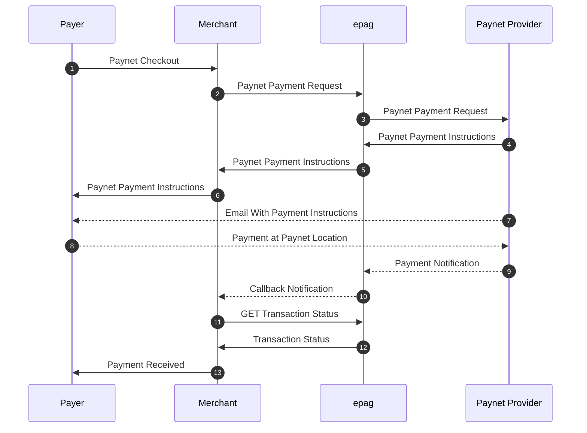

import Tabs from '@theme/Tabs';
import TabItem from '@theme/TabItem';

# Paynet

```jsx
  https://api-sandbox.epag.io/paynet/simple
```

## Overview

Integrating Paynet enables your business to serve customers who prefer to pay in cash or may not have access to traditional banking or credit cards. Our gateway simplifies the generation of the payment voucher or reference and provides you with a notification once the customer has completed the payment.

Here's a simplified breakdown of the typical Paynet payment process from a technical integration standpoint:

1. **Merchant Initiates Payment Request:** Your system sends a payment request to **our API**. This request includes essential transaction details such as the amount, a unique order identifier, and any necessary customer information for generating the Paynet reference.
2. **Paynet Reference/Barcode Generation:** Upon receiving your request, **our system** processes the information and interacts with the Paynet network. This generates a unique payment reference number or a barcode that the customer will use to make the payment.
3. **Presenting the Paynet Reference to the Payer:** **Our API** returns the generated Paynet reference data (e.g., the reference number, barcode image URL, or a link to a printable voucher) to your merchant system. Your application (e.g., e-commerce checkout page, confirmation email) then displays this information clearly to the customer, instructing them to use it to pay at a Paynet-affiliated location.
4. **Payer Makes the Cash Payment at a Physical Location:** The customer takes the Paynet reference (either by showing it on their phone or a printout) to any of the numerous authorized retail locations in the Paynet network across Mexico (such as OXXO, 7-Eleven, Walmart, Farmacias del Ahorro, etc.). They present the reference to the cashier and pay the exact amount due in cash.
5. **Payment Confirmation (Asynchronous):** After the customer pays at the physical location, the payment is recorded within the Paynet network. Confirmation of this payment is typically not instantaneous and is transmitted from the retail location through the Paynet system. This process can take up to one business day.
6. **Notification of Payment Confirmation:** Once **our system** receives the final confirmation from the Paynet network that the payment for the specific reference has been successfully completed, it **notifies your system** (e.g., via a webhook) about the payment status. This notification allows your system to update the order status and proceed with fulfilling the service or shipping the goods.

## Paynet Flow



## Request Fields

- `contract_id` (required/string): Merchant's contract id.
- `reference_id` (required/string/max 45 chars): External code created by the merchant to reference this payment (e.g. order number). Pattern is free and is used in reports and callbacks.
- `notification_url` (required/string): URL to post callbacks to this payment.
- `ip_address` (optional/string): Remote IP Address(IPv4/IPv6).
- `payment` (required/object): The payment data:
  - `amount` (float/required): Total amount of the payment. Value must have a maximum of two decimal places.
  - `asset` (optional/string): Reference code for asset for the sale's amount. Default: `MXN`.
  - `currency` (required/string): Currency code in ISO-4217.
  - `country` (required/string): Country code in ISO 3166-2.
  - `paynet` (optional/object): The Paynet payment data:
    - `expiration_date` (optional/date/YYYY-MM-DD): Expiration date (if not informed system will assume 5 days of current date).
    - `description` (optional/string): This is a message that goes attached to the transaction and will show at the recipient's bank statement.
    - `logo` (optional/string): The HTTP/Data URL of your logo (must be JPG or PNG format and it is recommended to be proportional to 200 x 45 pixels). If omitted, no logo will be displayed.
- `person` (required/object): The person data:
  - `full_name` (required/string): Person’s full name.
  - `email` (required/string): Person’s email provided to the merchant.
- `extra_data` (optional/JSON): Any data pertinent to the merchant.

## Response Fields

- `transaction_status` (string): Current status of the payment.
- `payment_token` (string): Unique payment identification for this payment.
- `reference_id` (string): External code created by the merchant to reference this payment (e.g. order number).
- `barcode_png_gzip_base_64` (string): Base64 zipped PNG image representation of Paynet barcode.
- `pdf_gzip_base_64` (string): Payment confirmation in Base64 zipped PDF format.
- `barcode` (string): Text string containing barcode to pay this payment.
- `amount` (string): Amount of this payment.
- `refresh_token` (string): Updated access token for future calls.
- `totals` (object): The payment totals:
  - `amount` (float): Amount in default region asset.
  - `asset` (string): Asset used in this amount.
  - `original_amount` (float): Amount as informed by merchant.
  - `original_asset` (string): Asset used in this originalAmount.
  - `customer_fees` (float): Total calculated fee assigned to customer.
  - `customer_amount` (float): Total amount for customer (`amount` + `customer_fees`).
- `customer_fees` (object): List of incident customer fees and respective values.

| AUTHORIZATION | API Key         | 
| ------------- | --------------- |
| Key           | X-Auth-Token    |
| Value         | MY_ACCESS_TOKEN |

### Body Raw(json)

```jsx title="json"
{
    "contract_id": "MY_CONTRACT_ID",
    "reference_id": "MY_REFERENCE_ID",
    "notification_url": "https://my.notification.url/callback/",
    "ip_address": "0.0.0.0",
    "payment": {
        "amount": 123.45,
        "asset": "MXN",
        "currency": "MXN",
        "country": "MX",
        "paynet": {
            "expiration_date": "2024-12-31",
            "description": "Payment via PAYNET",
            "logo": "data:image/png;base64,BASE64_ENCODED_IMAGE"
        }
    },
    "person": {
        "full_name": "Alice Sonnentag",
        "email": "alice@sonnentag.com"
    },
    "extra_data": {
        "my-conciliation-number": "xxxxxx"
    }
}
```

### Example Request

<Tabs>

  <TabItem value="success" label="200 - Success">
      #### Example Request
        ```jsx title="200 - Success"
            curl --location 'https://api-sandbox.epag.io/paynet/simple' \
            --header 'X-Auth-Token: MY_ACCESS_TOKEN' \
            --data-raw '{
                "contract_id": "MY_CONTRACT_ID",
                "reference_id": "MY_REFERENCE_ID",
                "notification_url": "https://my.notification.url/callback/",
                "ip_address": "0.0.0.0",
                "payment": {
                    "amount": 123.45,
                    "asset": "MXN",
                    "currency": "MXN",
                    "country": "MX",
                    "paynet": {
                        "expiration_date": "2024-12-31",
                        "description": "Payment via PAYNET",
                        "logo": "data:image/png;base64,BASE64_ENCODED_IMAGE"
                    }
                },
                "person": {
                    "full_name": "Alice Sonnentag",
                    "email": "alice@sonnentag.com"
                },
                "extra_data": {
                    "my-conciliation-number": "xxxxxx"
                }
            }'
        ```

      #### Example Response
        ```jsx title="Header"
          Content-Type: application/json
        ```  
        ```jsx title="Body"
            {
              "transaction_status": "PROCESSING",
              "payment_token": "0196e128-c6c7-4249-9f20-21a4c2eb1506",
              "reference_id": "MY_REFERENCE_ID",
              "barcode_png_gzip_base_64": "BASE64_ZIPPED_PNG",
              "pdf_gzip_base_64": "BASE64_ZIPPED_PDF",
              "barcode": "64000012578123060900025032",
              "amount": "123.45",
              "refresh_token": "MY_ACCESS_TOKEN",
              "totals": {
                "amount": 123.45,
                "original_amount": 123.45,
                "original_asset": "MXN",
                "customer_fees": 0,
                "customer_amount": 123.45,
                "asset": "MXN"
              },
              "customer_fees": {}
            }
        ```
    </TabItem>

    <TabItem value="bad-request" label="400 - Bad Request">
      #### Example Request
        ```jsx title="400 - Bad Request"
            curl --location 'https://api-sandbox.epag.io/paynet/simple' \
            --header 'X-Auth-Token: MY_ACCESS_TOKEN' \
            --data-raw '{
                "contract_id": "MY_CONTRACT_ID",
                "reference_id": "MY_REFERENCE_ID",
                "notification_url": "https://my.notification.url/callback/",
                "ip_address": "0.0.0.0",
                "person": {
                    "full_name": "Alice Sonnentag",
                    "email": "alice@sonnentag.com"
                },
                "extra_data": {
                    "my-conciliation-number": "xxxxxx"
                }
            }'
        ```

      #### Example Response
        ```jsx title="Header"
          Content-Type: application/json
        ```  
        ```jsx title="Body"
            {
              "timestamp": "2024-01-17T15:24:38.899+0000",
              "status": 400,
              "error": "Bad Request",
              "message": "payment: must not be null",
              "path": "/paynet/simple",
              "errors": [
                {
                  "code": "00.01.0044",
                  "description": "payment: must not be null"
                }
              ],
              "refresh_token": "MY_ACCESS_TOKEN"
            }
        ```
    </TabItem>

    <TabItem value="unauthorized" label="401 - Unauthorized">
      #### Example Request
        ```jsx title="401 - Unauthorized"
            curl --location 'https://api-sandbox.epag.io/paynet/simple' \
            --header 'X-Auth-Token: INVALID_ACCESS_TOKEN' \
            --data-raw '{
                "contract_id": "MY_CONTRACT_ID",
                "reference_id": "MY_REFERENCE_ID",
                "notification_url": "https://my.notification.url/callback/",
                "ip_address": "0.0.0.0",
                "payment": {
                    "amount": 123.45,
                    "asset": "MXN",
                    "currency": "MXN",
                    "country": "MX",
                    "paynet": {
                        "description": "Payment via PAYNET"
                    }
                },
                "person": {
                    "full_name": "Alice Sonnentag",
                    "email": "alice@sonnentag.com"
                },
                "extra_data": {
                    "my-conciliation-number": "xxxxxx"
                }
            }'
        ```

      #### Example Response
        ```jsx title="Header"
          Content-Type: application/json
        ```  
        ```jsx title="Body"
            {
              "timestamp": "2024-01-16T15:35:10.131+0000",
              "status": 401,
              "error": "Unauthorized",
              "message": "Access Denied",
              "path": "/paynet/simple"
            }
        ```
    </TabItem>

    <TabItem value="unprocessable-entity" label="422 - Unprocessable Entity">
      #### Example Request
        ```jsx title="422 - Unprocessable Entity"
            curl --location 'https://api-sandbox.epag.io/paynet/simple' \
            --header 'X-Auth-Token: MY_ACCESS_TOKEN' \
            --data-raw '{
                "contract_id": "MY_CONTRACT_ID",
                "reference_id": "MY_REFERENCE_ID",
                "notification_url": "https://my.notification.url/callback/",
                "ip_address": "0.0.0.0",
                "payment": {
                    "amount": 123.45,
                    "asset": "MXN",
                    "currency": "MXN",
                    "country": "MX",
                    "paynet": {
                        "description": "Payment via PAYNET"
                    }
                },
                "person": {
                    "full_name": "Alice Sonnentag",
                    "email": "alice@sonnentag.com"
                },
                "extra_data": {
                    "my-conciliation-number": "xxxxxx"
                }
            }'
        ```

      #### Example Response
        ```jsx title="Header"
          Content-Type: application/json
        ```  
        ```jsx title="Body"
            {
              "timestamp": "2024-01-16T20:50:25.715+0000",
              "status": 422,
              "error": "Unprocessable Entity",
              "message": "Invalid contract / project",
              "path": "/paynet/simple",
              "errors": [
                {
                  "code": "00.01.0021",
                  "description": "Invalid contract / project"
                }
              ],
              "refresh_token": "MY_ACCESS_TOKEN"
            }
        ```
    </TabItem>

    <TabItem value="bad-gateway" label="502 - Bad Gateway">
      #### Example Request
        ```jsx title="502 - Bad Gateway"
            curl --location 'https://api-sandbox.epag.io/paynet/simple' \
            --header 'X-Auth-Token: MY_ACCESS_TOKEN' \
            --data-raw '{
                "contract_id": "MY_CONTRACT_ID",
                "reference_id": "MY_REFERENCE_ID",
                "notification_url": "https://my.notification.url/callback/",
                "ip_address": "0.0.0.0",
                "payment": {
                    "amount": 123.45,
                    "asset": "MXN",
                    "currency": "MXN",
                    "country": "MX",
                    "paynet": {
                        "description": "Payment via PAYNET"
                    }
                },
                "person": {
                    "full_name": "Alice Sonnentag",
                    "email": "alice@sonnentag.com"
                },
                "extra_data": {
                    "my-conciliation-number": "xxxxxx"
                }
            }'
        ```

      #### Example Response
        ```jsx title="Header"
          Content-Type: application/json
        ```  
        ```jsx title="Body"
            {
              "timestamp": "2024-01-16T20:12:28.156+0000",
              "status": 502,
              "error": "Bad Gateway",
              "message": "There was an issue when contacting an external API, please contact support",
              "path": "/paynet/simple",
              "errors": [
                {
                  "code": "00.03.0001",
                  "description": "There was an issue when contacting an external API, please contact support"
                }
              ],
              "refresh_token": "MY_ACCESS_TOKEN"
            }
        ```
    </TabItem>
    
</Tabs>