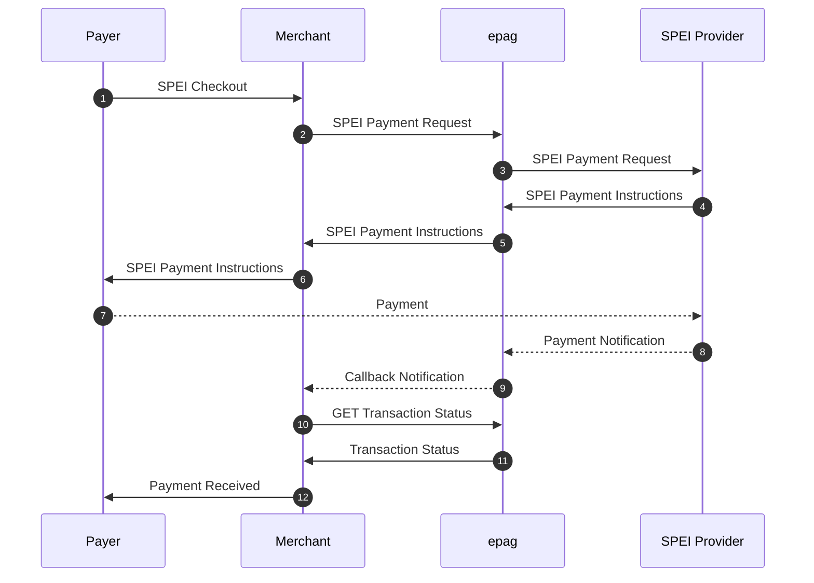

import Tabs from '@theme/Tabs';
import TabItem from '@theme/TabItem';

# SPEI

```jsx
  https://api-sandbox.epag.io/spei/simple
```

## Overview

Integrating SPEI allows your business to offer a trusted and efficient payment method widely used by individuals and businesses in Mexico. Our gateway streamlines the process of generating the necessary payment instructions for your customers and provides you with instant confirmation of the payment.  

Here's a simplified breakdown of the typical SPEI payment process from a technical integration standpoint:

1. **Merchant Initiates Payment Request:** Your system sends a payment request to **our API**. This request includes essential transaction details such as the amount, a unique order identifier, and information needed to generate the SPEI payment instructions for your customer.
2. **SPEI Payment Instruction Generation:** Upon receiving your request, **our system** processes the information and generates the specific details the customer needs to make a SPEI transfer to your account. This typically includes:
    - Your business's `CLABE` (Clave Bancaria Estandarizada), the standardized 18-digit bank account number in Mexico.
    - The `amount` to be transferred.
    - A unique `reference number` or payment concept to help identify the transaction.
3. **Presenting Payment Instructions to the Payer:** **Our API** returns these SPEI payment instructions to your merchant system. Your application (e.g., e-commerce checkout page, invoice, payment confirmation screen) then displays these instructions clearly to the customer, guiding them to initiate a SPEI transfer from their own bank account.
4. **Payer Initiates SPEI Transfer:** The customer accesses their own online banking platform or mobile banking app provided by their bank in Mexico. They initiate a SPEI transfer using the CLABE, amount, and reference number/concept provided by your system.
5. **Real-time Payment Processing and Confirmation:** The SPEI system, managed by the Bank of Mexico, processes the transfer in real-time. The funds are moved directly from the customer's bank account to your business's bank account within seconds.
6. **Instant Notification of Payment Confirmation:** Once the SPEI transfer is successfully completed, **our system** receives immediate, real-time confirmation from the SPEI network. We then instantly **notify your system** (e.g., via a webhook) about the successful payment. This instant notification allows your business to confirm the order and provide the goods or services without delay.

## SPEI Flow



## Request Fields
- `contract_id` (required/string): Merchant's contract id.
- `payment` (required/object): The payment data:
  - `amount` (float/required): Total amount of the payment. Value must have a maximum of two decimal places.
  - `asset` (optional/string): Reference code for asset for the sale's amount. Default: `MXN`.
  - `currency` (required/string): Currency code in ISO-4217.
  - `country` (required/string): Country code in ISO 3166-2.
  - `spei` (optional/object): The SPEI payment data:
    - `description` (optional/string): This is a message that goes attached to the transaction and will show at the recipient's bank statement.
    - `logo` (optional/string): The HTTP/Data URL of your logo (must be JPG or PNG format and it is recommended to be proportional to 200 x 45 pixels). If omitted, no logo will be displayed.
- `person` (required/object): The person data:
  - `full_name` (required/string): Person’s full name.
  - `email` (required/string): Person’s email provided to the merchant.
- `notification_url` (required/required): URL to post callbacks to this payment.
- `reference_id` (required/required/max 45 chars): External code created by the merchant to reference this payment (e.g. order number). Pattern is free and is used in reports and callbacks.
- `extra_data` (optional/JSON): Any data pertinent to the merchant.
- `ip_address` (optional/string): Remote IP Address(IPv4/IPv6).

## Response Fields

- `transaction_status` (string): Current status of the payment.
- `payment_token` (string): Unique payment identification for this payment.
- `reference_id` (string): External code created by the merchant to reference this payment (e.g. order number).
- `pdf_gzip_base_64` (string): Payment confirmation in Base64 zipped PDF format.
- `clabe` (string): Unique interbank CLABE.
- `amount` (string): Amount of this payment.
- `refresh_token` (string): Updated access token for future calls.
- `totals` (object): The payment totals:
  - `amount` (float): Amount in default region asset.
  - `asset` (string): Asset used in this amount.
  - `original_amount` (float): Amount as informed by merchant.
  - `original_asset` (string): Asset used in this originalAmount.
  - `customer_fees` (float): Total calculated fee assigned to customer.
  - `customer_amount` (float): Total amount for customer (`amount` + `customer_fees`).
- `customer_fees` (object): List of incident customer fees and respective values.

| AUTHORIZATION | API Key         | 
| ------------- | --------------- |
| Key           | X-Auth-Token    |
| Value         | MY_ACCESS_TOKEN |

### Body Raw(json)

```jsx title="json"
{
    "contract_id": "MY_CONTRACT_ID",
    "reference_id": "MY_REFERENCE_ID",
    "notification_url": "https://my.notification.url/callback/",
    "ip_address": "0.0.0.0",
    "payment": {
        "amount": 123.45,
        "asset": "MXN",
        "currency": "MXN",
        "country": "MX",
        "spei": {
            "description": "Payment via SPEI",
            "logo": "data:image/png;base64,BASE64_ENCODED_IMAGE"
        }
    },
    "person": {
        "full_name": "Alice Sonnentag",
        "email": "alice@sonnentag.com"
    },
    "extra_data": {
        "my-conciliation-number": "xxxxxx"
    }
}
```

### Example Request

<Tabs>

  <TabItem value="success" label="200 - Success">
      #### Example Request
        ```jsx title="200 - Success"
            curl --location 'https://api-sandbox.epag.io/spei/simple' \
            --header 'X-Auth-Token: MY_ACCESS_TOKEN' \
            --data-raw '{
                "contract_id": "MY_CONTRACT_ID",
                "reference_id": "MY_REFERENCE_ID",
                "notification_url": "https://my.notification.url/callback/",
                "ip_address": "0.0.0.0",
                "payment": {
                    "amount": 123.45,
                    "asset": "MXN",
                    "currency": "MXN",
                    "country": "MX",
                    "spei": {
                        "description": "Payment via SPEI",
                        "logo": "data:image/png;base64,BASE64_ENCODED_IMAGE"
                    }
                },
                "person": {
                    "full_name": "Alice Sonnentag",
                    "email": "alice@sonnentag.com"
                },
                "extra_data": {
                    "my-conciliation-number": "xxxxxx"
                }
            }'
        ```

      #### Example Response
        ```jsx title="Header"
          Content-Type: application/json
        ```  
        ```jsx title="Body"
            {
              "transaction_status": "PROCESSING",
              "payment_token": "0196e128-c6c7-4249-9f20-21a4c2eb1506",
              "reference_id": "MY_REFERENCE_ID",
              "pdf_gzip_base_64": "BASE64_ZIPPED_PDF",
              "clabe": "646180179900004256",
              "amount": "123.45",
              "refresh_token": "MY_ACCESS_TOKEN",
              "totals": {
                "amount": 123.45,
                "original_amount": 123.45,
                "original_asset": "MXN",
                "customer_fees": 0,
                "customer_amount": 123.45,
                "asset": "MXN"
              },
              "customer_fees": {}
            }
        ```
    </TabItem>

    <TabItem value="bad-request" label="400 - Bad Request">
      #### Example Request
        ```jsx title="400 - Bad Request"
            curl --location 'https://api-sandbox.epag.io/spei/simple' \
            --header 'X-Auth-Token: MY_ACCESS_TOKEN' \
            --data-raw '{
                "contract_id": "MY_CONTRACT_ID",
                "reference_id": "MY_REFERENCE_ID",
                "notification_url": "https://my.notification.url/callback/",
                "ip_address": "0.0.0.0",
                "person": {
                    "full_name": "Alice Sonnentag",
                    "email": "alice@sonnentag.com"
                },
                "extra_data": {
                    "my-conciliation-number": "xxxxxx"
                }
            }'
        ```

      #### Example Response
        ```jsx title="Header"
          Content-Type: application/json
        ```  
        ```jsx title="Body"
            {
              "timestamp": "2024-01-17T15:24:38.899+0000",
              "status": 400,
              "error": "Bad Request",
              "message": "payment: must not be null",
              "path": "/spei/simple",
              "errors": [
                {
                  "code": "00.01.0044",
                  "description": "payment: must not be null"
                }
              ],
              "refresh_token": "MY_ACCESS_TOKEN"
            }
        ```
    </TabItem>

    <TabItem value="unauthorized" label="401 - Unauthorized">
      #### Example Request
        ```jsx title="401 - Unauthorized"
            curl --location 'https://api-sandbox.epag.io/spei/simple' \
            --header 'X-Auth-Token: INVALID_ACCESS_TOKEN' \
            --data-raw '{
                "contract_id": "MY_CONTRACT_ID",
                "reference_id": "MY_REFERENCE_ID",
                "notification_url": "https://my.notification.url/callback/",
                "ip_address": "0.0.0.0",
                "payment": {
                    "amount": 123.45,
                    "asset": "MXN",
                    "currency": "MXN",
                    "country": "MX",
                    "spei": {
                        "description": "Payment via SPEI"
                    }
                },
                "person": {
                    "full_name": "Alice Sonnentag",
                    "email": "alice@sonnentag.com"
                },
                "extra_data": {
                    "my-conciliation-number": "xxxxxx"
                }
            }'
        ```

      #### Example Response
        ```jsx title="Header"
          Content-Type: application/json
        ```  
        ```jsx title="Body"
            {
              "timestamp": "2024-01-16T15:35:10.131+0000",
              "status": 401,
              "error": "Unauthorized",
              "message": "Access Denied",
              "path": "/spei/simple"
            }
        ```
    </TabItem>

    <TabItem value="unprocessable-entity" label="422 - Unprocessable Entity">
      #### Example Request
        ```jsx title="422 - Unprocessable Entity"
            curl --location 'https://api-sandbox.epag.io/spei/simple' \
            --header 'X-Auth-Token: MY_ACCESS_TOKEN' \
            --data-raw '{
                "contract_id": "MY_CONTRACT_ID",
                "reference_id": "MY_REFERENCE_ID",
                "notification_url": "https://my.notification.url/callback/",
                "ip_address": "0.0.0.0",
                "payment": {
                    "amount": 123.45,
                    "asset": "MXN",
                    "currency": "MXN",
                    "country": "MX",
                    "spei": {
                        "description": "Payment via SPEI"
                    }
                },
                "person": {
                    "full_name": "Alice Sonnentag",
                    "email": "alice@sonnentag.com"
                },
                "extra_data": {
                    "my-conciliation-number": "xxxxxx"
                }
            }'
        ```

      #### Example Response
        ```jsx title="Header"
          Content-Type: application/json
        ```  
        ```jsx title="Body"
            {
              "timestamp": "2024-01-16T20:50:25.715+0000",
              "status": 422,
              "error": "Unprocessable Entity",
              "message": "Invalid contract / project",
              "path": "/spei/simple",
              "errors": [
                {
                  "code": "00.01.0021",
                  "description": "Invalid contract / project"
                }
              ],
              "refresh_token": "MY_ACCESS_TOKEN"
            }
        ```
    </TabItem>

    <TabItem value="bad-gateway" label="502 - Bad Gateway">
      #### Example Request
        ```jsx title="502 - Bad Gateway"
            curl --location 'https://api-sandbox.epag.io/spei/simple' \
            --header 'X-Auth-Token: MY_ACCESS_TOKEN' \
            --data-raw '{
                "contract_id": "MY_CONTRACT_ID",
                "reference_id": "MY_REFERENCE_ID",
                "notification_url": "https://my.notification.url/callback/",
                "ip_address": "0.0.0.0",
                "payment": {
                    "amount": 123.45,
                    "asset": "MXN",
                    "currency": "MXN",
                    "country": "MX",
                    "spei": {
                        "description": "Payment via SPEI"
                    }
                },
                "person": {
                    "full_name": "Alice Sonnentag",
                    "email": "alice@sonnentag.com"
                },
                "extra_data": {
                    "my-conciliation-number": "xxxxxx"
                }
            }'
        ```

      #### Example Response
        ```jsx title="Header"
          Content-Type: application/json
        ```  
        ```jsx title="Body"
            {
              "timestamp": "2024-01-16T20:12:28.156+0000",
              "status": 502,
              "error": "Bad Gateway",
              "message": "There was an issue when contacting an external API, please contact support",
              "path": "/spei/simple",
              "errors": [
                {
                  "code": "00.03.0001",
                  "description": "There was an issue when contacting an external API, please contact support"
                }
              ],
              "refresh_token": "MY_ACCESS_TOKEN"
            }
        ```
    </TabItem>
    
</Tabs>