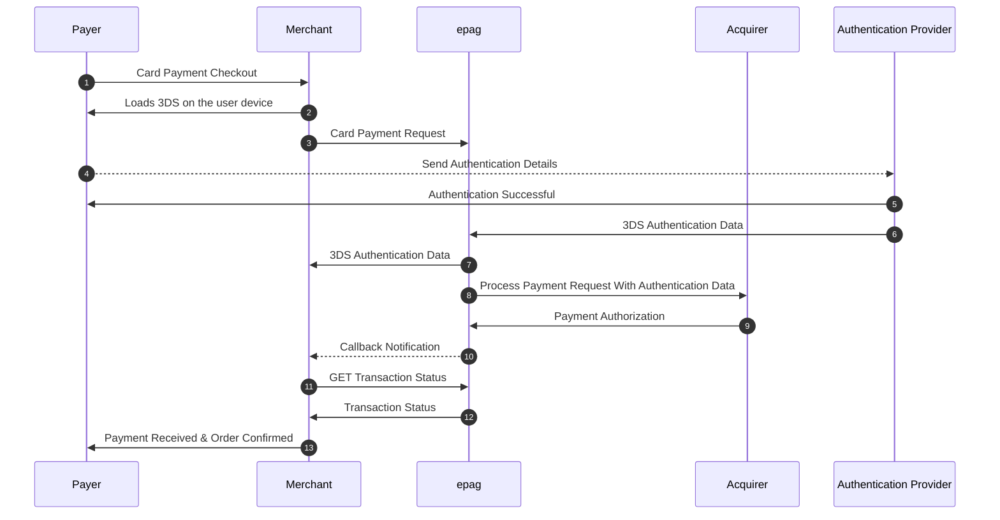
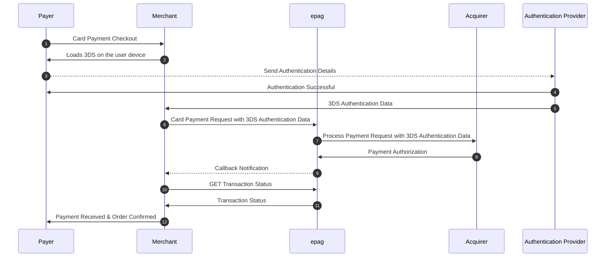

# Credit Card 3DS

## Overview

This document provides comprehensive details on the integrated **3D Secure (3DS) authentication and payment process** for credit card transactions conducted in the card-not-present environment. 3DS serves as a critical additional security layer, designed to combat online fraud by introducing a mandatory cardholder verification step handled directly by the cardholder's issuing bank.
Only upon successful authentication, where the cardholder confirms their identity through methods like passwords, one-time codes, or biometric verification, does the payment transaction proceed to authorization and subsequent processing.
This combined approach significantly enhances security for all parties involved and can offer merchants benefits such as reduced chargebacks and potential liability shift.


## How 3DS Works

1. The customer initiates a payment request.
2. The payment gateway redirects the user to the issuing bank for authentication.
3. The bank may request additional verification (e.g., password, SMS code, biometric authentication).
4. Once verified, the bank sends a confirmation token.
5. The transaction is processed based on the authentication result.

## 3DS Card Payment Checkout Internal Authentication (epag)

Merchants have the option to integrate and utilize their own MPI or an external third-party MPI to handle the 3D Secure authentication flow directly.

However, if your business **does not wish to use, or does not have access to, an external MPI** and you want us to manage the entire 3D Secure authentication process on your behalf, **the use of our SDK is required for these 3DS transactions**.

Our SDK is designed to abstract the complexities of the 3DS flow, acting as the necessary component to communicate with the cardholder's bank and complete the authentication when you are not using your own MPI. By utilizing **our SDK**, you enable us to handle the technical steps of 3DS seamlessly within your integration, ensuring a smoother experience and potential liability benefits with minimal development effort on your side regarding the MPI functionality.

Therefore, if you are not processing 3DS through an external MPI and want **us** to handle it, please ensure your integration for 3DS transactions utilizes <a href="https://3ds.epag.io/scripts/client-v1.0.min.js" target="_blank" rel="noopener noreferrer"><b>our provided SDK</b></a>.



## 3DS Card Payment Checkout External Authentication



## 3DS Authentication Fields

The following fields are used for **3DS authentication** within the payment request:

```json
"authentication": {
    "cavv": "BwABBylVaQAAAAFwllVpAAAAAAA=",
    "xid": "BwABBylVaQAAAAFwllVpAAAAAAA=",
    "eci": "05",
    "version": "2.1.0",
    "dstrans_id": "DIR_SERVER_TID"
}
```

### Field Descriptions

- `cavv` (*string*): Cardholder authentication verification value.
- `xid` (*string*): Transaction identifier for authentication tracking.
- `eci` (*string*): Electronic commerce indicator showing authentication success/failure.
- `version` (*string*): 3DS protocol version used (e.g., "2.1.0").
- `dstrans_id` (*string*): Unique transaction ID from the directory server.

## Example 3DS Payment Request

```json
{
    "payment": {
        "method": "CREDITCARD",
        "amount": 150.00,
        "currency": "USD",
        "card": {
            "number": "4111111111111111",
            "holder": "John Doe",
            "cvv": "123",
            "year": 2027,
            "month": 10,
            "installments": 1,
            "authentication": {
                "cavv": "BwABBylVaQAAAAFwllVpAAAAAAA=",
                "xid": "BwABBylVaQAAAAFwllVpAAAAAAA=",
                "eci": "05",
                "version": "2.1.0",
                "dstrans_id": "DIR_SERVER_TID"
            }
        }
    }
}
```

## 3DS Authentication Flow

1. `Initiate Payment`: Send a payment request containing the `authentication` object.
2. `Bank Redirection`: If required, the customer is redirected to the bank’s authentication page.
3. `Verification Response`: The bank returns a response (successful or failed authentication).
4. `Process Payment`: The payment is processed based on the authentication outcome.

## Considerations

- 3DS **reduces fraud risk** by verifying the cardholder’s identity.
- Some transactions may **bypass authentication** depending on bank risk analysis.
- Ensure your **payment gateway supports 3DS** to enable smooth authentication handling.

## Example Response

```json
{
    "transaction_status": "PROCESSING",
    "payment_token": "0196e128-c6c7-4249-9f20-21a4c2eb1506",
    "reference_id": "MY_REFERENCE_ID",
    "public_person_id": "PER-715a6579-e420-4098-b18a-918cc732224d",
    "public_card_id": "CAR-cbd3dfd8-4e0e-4525-a80b-db361f3189be",
    "amount": "123.45",
    "refresh_token": "MY_ACCESS_TOKEN",
    "totals": {
    "amount": 123.45,
    "original_amount": 123.45,
    "original_asset": "BRL",
    "customer_fees": 0,
    "customer_amount": 123.45,
    "asset": "BRL"
    },
    "customer_fees": {}
}
```

This document provides the necessary details to implement **3DS authentication** in credit card transactions securely.

