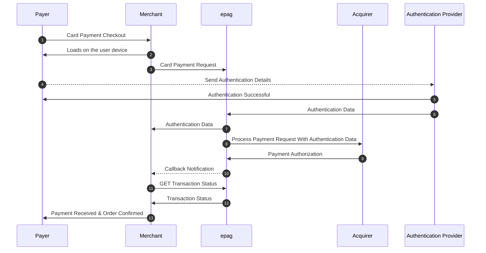
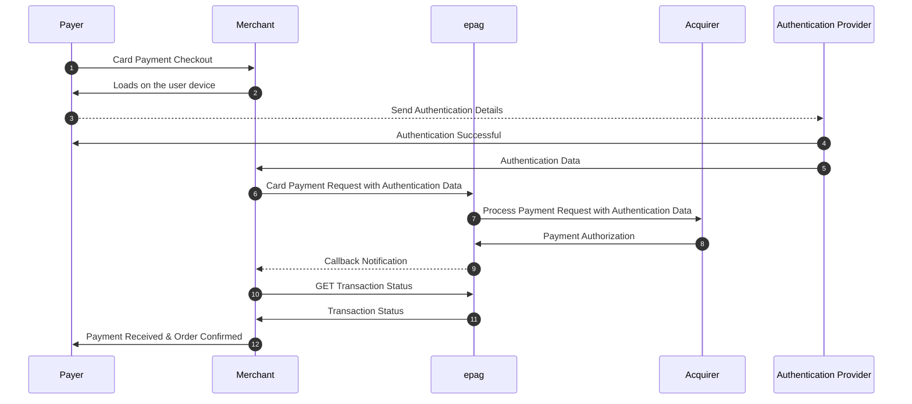

# Debit Card

## Overview

**Debit card payments** allow customers to pay for goods and services using funds available directly in their linked bank account. When a customer makes a purchase with a debit card, the amount is typically deducted from their account almost immediately or within a very short processing window. This means customers are spending their own existing money.  

In contrast, **credit card payments** utilize a line of credit extended by the card issuer. When a customer pays with a credit card, they are essentially borrowing money, which they will repay to the issuer later, usually on a monthly billing cycle.  

**Short Comparison:**
    - **Debit Card:** Uses existing funds in a bank account; funds are debited immediately or very quickly.
    - **Credit Card:** Uses a line of credit; payment is deferred to a later billing date.

**Similarity to 3DS Authenticated Credit Card Transactions:**

A key similarity exists between a standard debit card transaction and a 3D Secure (3DS) authenticated credit card transaction in terms of the verification step and the timing of fund confirmation.

While the underlying funding mechanism differs (existing funds vs. credit line), both scenarios involve a crucial, often real-time, communication with the issuing bank to verify the validity of the transaction and the availability of the means to pay (either funds or authorized credit access verified through authentication) before the transaction is fully approved. This contrasts with non-3DS credit card transactions, where the primary authorization focuses on the card details and credit limit without the additional real-time cardholder verification by the issuer.


## How Debit Card Payments Work

1. The customer enters debit card details.
2. The payment gateway may require additional authentication (e.g., **3DSecure** or OTP verification).
3. The bank verifies fund availability and approves the transaction.
4. The payment is instantly debited from the customer’s account.

## Debit Card Payment Checkout Internal Authentication (epag)


## Debit Card Payment Checkout External Authentication



## Debit Card Payment Fields

To process a debit card transaction, set `method` to `DEBITCARD`:

```json
"payment": {
    "method": "DEBITCARD",
    "amount": 100.00,
    "currency": "USD",
    "card": {
        "number": "5222222222222222",
        "holder": "John Doe",
        "cvv": "456",
        "year": 2026,
        "month": 11
    }
}
```

## Additional Authentication

Some debit card transactions require **3D Secure authentication**, similar to credit cards. In such cases, include the `authentication` object:

```json
"authentication": {
    "cavv": "BwABBylVaQAAAAFwllVpAAAAAAA=",
    "xid": "BwABBylVaQAAAAFwllVpAAAAAAA=",
    "eci": "05",
    "version": "2.1.0",
    "dstrans_id": "DIR_SERVER_TID"
}
```

## Example Response

```json
{
    "transaction_id": "TRANSACTION_98765",
    "status": "AUTHORIZED",
    "authorization_code": "AUTH_54321"
}
```

## Considerations

- Debit card payments **require sufficient funds** at the time of purchase.
- Some issuers **require additional authentication** for security purposes.
- **Refund processing** may vary depending on the bank’s policies.

By supporting debit card payments, merchants can provide **real-time transactions** with added security measures.

