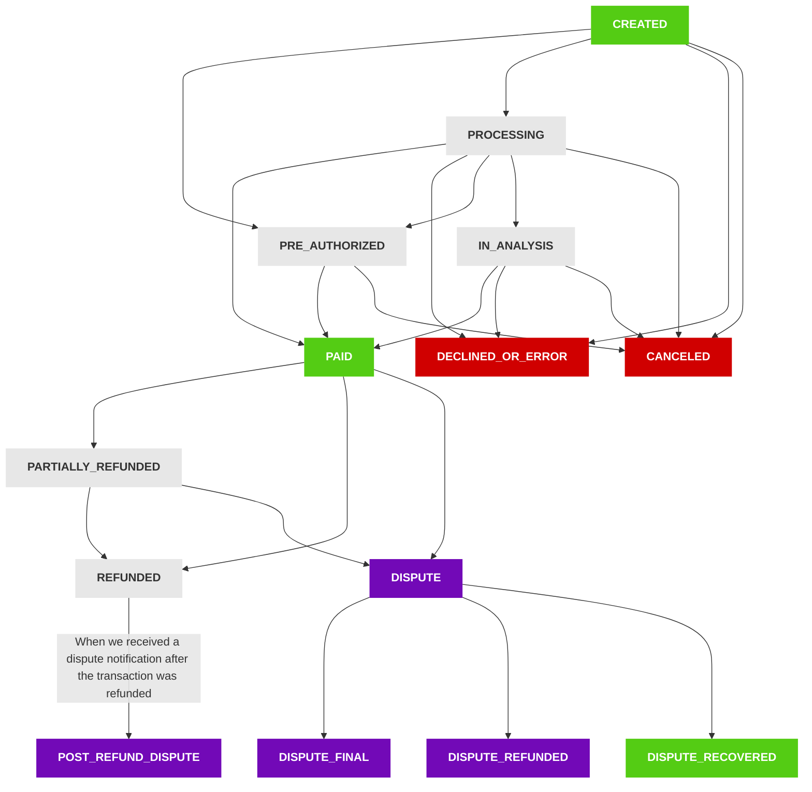

# Transaction Status Map

The following diagram covers the possible status flow for all our transactions. For every status change a webhook notification is sent to the merchant's API.

## Status Description

- **CREATED:** The payment has been initiated and is awaiting processing.

- **PROCESSING:** The payment request has been accepted by the processor and is currently under processing.

- **PRE_AUTHORIZED:** The payment is pre-authorized and available for the merchant to capture.

- **PAID:** The payment has been authorized by the processor. Refer to the "received amount" field to verify the paid sum.

- **PARTIALLY_REFUNDED:** Partial refunds have been issued, not covering the full payment amount.

- **REFUNDED:** The payment was refunded by the merchant to its full amount.

- **DECLINED:** The payment was not accepted. The "errors" field contains an error code and description detailing the reason for decline.

- **CANCELED:** The payment was voided due to reasons such as transaction expiration or cancellation of pre-authorized transactions.

- **ERROR:** An unexpected error occurred during the payment process. The "errors" field contains an error code and description explaining the error's cause.

- **IN_ANALYSIS:** The transaction is currently under manual review.

- **DISPUTE:** The payer has initiated a dispute over the transaction.

- **DISPUTE_REFUNDED:** The disputed payment has been refunded.

- **POST_REFUND_DISPUTE:** A dispute was raised post-refund.

- **DISPUTE_RECOVERED:** The payment was subject to a dispute, which has now been resolved in favor of the merchant.

- **DISPUTE_FINAL:** The payment was disputed and the decision to revert it is final.